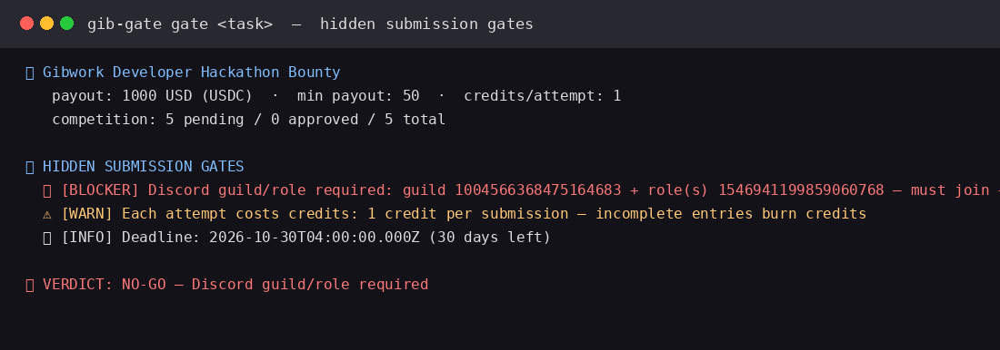
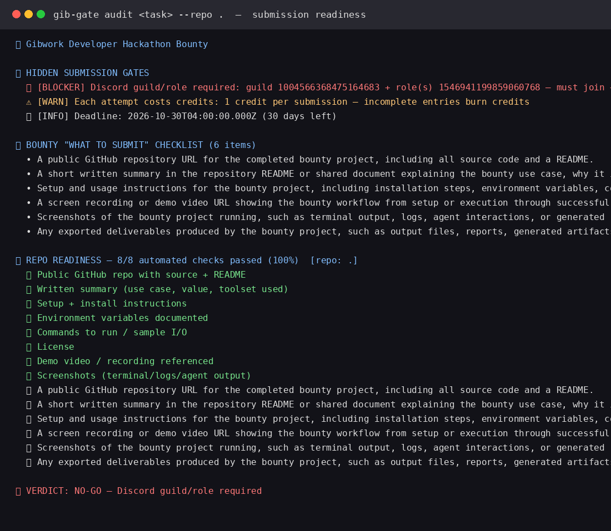

# gib-gate — Gibwork Submission Gate & Readiness Auditor

**A non-web terminal CLI + MCP server that tells you whether you should even start a Gibwork bounty — and whether your submission is complete — before you burn a submission attempt.**

> Gibwork Developer Hackathon Bounty · non-web use case built on the **Gibwork SDK + MCP**.

---

## Demo

**The moment it earns its name** — `gib-gate gate` surfaces a Discord-role blocker that the Gibwork UI buries, before you write a line of code:



**Submission readiness** — `gib-gate audit` checks your repo against the bounty's own "What to Submit" checklist and tells you what's missing:



**Screen recording** of the workflow: [`demo/demo-gate.mp4`](demo/demo-gate.mp4) (13s)

Raw captured output lives in [`demo/*.txt`](demo/). Tests: `node --test` (4/4 pass).

---

## Why this exists

Every existing Gibwork tool answers *"which bounty should I work on?"* — they **discover, rank, watch, and verify escrow**. That space is crowded.

Nobody answers the question that actually wastes developer hours: **"Am I even allowed to submit this, and is my submission complete before I hit Submit?"**

Gibwork hides the real submission constraints in API fields the UI barely surfaces:

- `requiredDiscordRoleIds` / `allowOnlyDiscordGuildSubmissions` — you must join a Discord server **and be granted a specific role** before you can submit. Miss it and your work is void.
- `creditCostPerSubmission` — every attempt costs credits. A sloppy entry burns one.
- `maxSubmissions` / `taskSubmissionsPendingCount` — how crowded the field is and whether the window is closing.
- `minSubmissionAmount`, `allowOnlyVerifiedSubmissions`, `minTwitterFollowers`, `deadline`.

You discover these *after* you've already built. `gib-gate` surfaces them **in one command, before you start**.

Then it audits your repo against the bounty's own **"What to Submit"** checklist and tells you exactly which deliverable is missing — so every submission is complete on the first try.

## What it does

| Command | What it answers |
|---|---|
| `gib-gate gate <taskId>` | Hidden submission gates + competition + **GO / CONDITIONAL / NOT-READY / NO-GO** verdict |
| `gib-gate audit <taskId> --repo <path>` | Gates **+** repo readiness vs the bounty's "What to Submit" checklist + fix-list |
| `gib-gate list` | Open bounties via the official `@gibwork/sdk` |
| `gib-gate doctor` | Node / signer / SDK health |
| MCP: `gib_submission_gate`, `gib_submission_audit`, `gib_list_bounties` | Same, callable from Claude / Cursor / Codex / any MCP client |

## Gibwork toolset used (core)

- **`@gibwork/sdk`** (`GibworkClient.tasks.listAvailable`, `.get`) — the official TypeScript client for authenticated discovery. Used as the primary data layer when a keypair is configured (`GIBWORK_KEYPAIR_PATH`); a throwaway keypair (no funds) signs the auth challenge for read-only calls.
- **`@gibwork/mcp`** — installed alongside; `gib-gate` ships its own read-only MCP server that layers the gate/audit analysis on top of Gibwork bounty data for agent workflows.
- Public read surface (`https://gib.work/api/tasks/{id}`) — the same endpoint the Gibwork web app calls — used as the reliable no-auth fallback for bounty detail.

## Non-web by design

Everything runs in a terminal or as an MCP stdio server inside an AI coding agent. No dashboard, no browser, no frontend. This is deliberately a **developer/agent workflow tool**.

---

## Install & setup

```bash
git clone https://github.com/<you>/gib-gate.git
cd gib-gate
npm install
npm link          # optional: puts gib-gate on PATH
```

Requirements: **Node.js ≥ 18**.

### Environment variables (optional)

| Var | Purpose |
|---|---|
| `GIBWORK_KEYPAIR_PATH` | Path to a Solana keypair JSON for wallet-authenticated `@gibwork/sdk` calls (submit/pay). Omit to run read-only with a throwaway signer. |

Copy `.env.example` → `.env` if you use a keypair. **No keypair, wallet, or funds are needed for read-only gate/audit.**

---

## Usage

```bash
# 1. Should I even start this bounty? (surfaces hidden gates)
gib-gate gate 1052f22d-3f87-4b1d-b0d7-71a60679e7fa

# 2. Is my submission complete? (gates + repo readiness + fix-list)
gib-gate audit 1052f22d-3f87-4b1d-b0d7-71a60679e7fa --repo .

# 3. What's open? (via @gibwork/sdk)
gib-gate list --limit 10

# 4. Health
gib-gate doctor
```

### Sample output — `gate`

```
🎯 Gibwork Developer Hackathon Bounty
   payout: 1000 USD (USDC)  ·  min payout: 50  ·  credits/attempt: 1
   competition: 5 pending / 0 approved / 5 total

🚦 HIDDEN SUBMISSION GATES
  ⛔ [BLOCKER] Discord guild/role required: guild 1004566368475164683 + role(s) 1546941199859060768 — must join + be granted the role before submitting
  ⚠️ [WARN] Each attempt costs credits: 1 credit per submission — incomplete entries burn credits
  ℹ️ [INFO] Deadline: 2026-10-30T04:00:00.000Z (30 days left)

🚦 VERDICT: NO-GO — Discord guild/role required
```

The Gibwork web UI shows a bounty's payout and description. It does **not** tell you that a Discord role is a hard blocker until you've already built. `gib-gate` makes it the first line.

### Sample output — `audit`

```
📋 BOUNTY "WHAT TO SUBMIT" CHECKLIST (6 items)
  • A public GitHub repository URL for the completed bounty project…
  • A short written summary… which Gibwork toolset was used (SDK, CLI, or MCP)…
  …

📁 REPO READINESS — 8/8 automated checks passed (100%)  [repo: .]
  ✅ Public GitHub repo with source + README
  ✅ Written summary (use case, value, toolset used)
  ✅ Setup + install instructions
  ✅ Environment variables documented
  ✅ Commands to run / sample I/O
  ✅ License
  ✅ Demo video / recording referenced
  ✅ Screenshots (terminal/logs/agent output)

🚦 VERDICT: GO — submission-ready (100%)
```

---

## MCP setup (agents)

`gib-gate` is a Model Context Protocol stdio server, so any MCP client can call it.

**Cursor** (`~/.cursor/mcp.json`) / **Claude Desktop** — same shape:
```json
{
  "mcpServers": {
    "gib-gate": {
      "command": "node",
      "args": ["/absolute/path/to/gib-gate/src/mcp.js"]
    }
  }
}
```

Then ask the agent:
> "Use gib_submission_gate to check whether I can submit to this Gibwork bounty, and gib_submission_audit to see what's missing from my repo."

MCP tools exposed: `gib_submission_gate`, `gib_submission_audit`, `gib_list_bounties`.

---

## How it works

1. **Fetch** a Gibwork bounty via `@gibwork/sdk` (authenticated) or the public task API (no auth).
2. **Extract hidden gates** from structured fields (`requiredDiscordRoleIds`, `creditCostPerSubmission`, `maxSubmissions`, `deadline`, Twitter/verification flags) → severity-tagged `BLOCKER / WARN / INFO`.
3. **Parse the "What to Submit" + "Requirements"** sections into a structured checklist.
4. **Audit a local repo** against objective deliverable checks (README, summary, setup, env vars, commands, license, demo, screenshots).
5. **Render a verdict**: `GO` · `CONDITIONAL` · `NOT-READY` · `NO-GO` + a concrete fix-list.

## Testing

```bash
node --test          # unit self-checks for gate extraction + repo audit (no network)
```

## Limitations (honest)

- Read-only: `gib-gate` never submits or moves funds — it tells you *whether* to submit. Submission/pay actions use `@gibwork/sdk` with a funded keypair and are intentionally out of scope here.
- Repo audit checks objective, file/README-based deliverables. Human-judged quality (is the demo *good*?) is a manual `🔎` item.
- The public task API is the same surface the web app uses; if Gibwork changes it, the `@gibwork/sdk` path remains the primary authenticated source.

## License

MIT
