# gib-gate



**Know if you're even allowed to submit a Gibwork bounty — and whether your
submission is complete — before you burn a submission attempt.**

## The problem

Every existing Gibwork tool answers *"which bounty should I work on?"* — they
discover, rank, watch, verify escrow. Nobody answers the question that wastes
developer hours: **"Am I allowed to submit this, and is it complete before I
hit Submit?"**

Gibwork hides the real constraints in API fields the UI barely surfaces:

- `requiredDiscordRoleIds` / `allowOnlyDiscordGuildSubmissions` — you must join
  a Discord server **and hold a specific role** before submitting. Miss it and
  your work is void.
- `creditCostPerSubmission` — every attempt costs credits. A sloppy entry burns one.
- `maxSubmissions` / `taskSubmissionsPendingCount` — how crowded the field is.
- `minSubmissionAmount`, `allowOnlyVerifiedSubmissions`, `minTwitterFollowers`, `deadline`.

You discover these *after* you've already built. `gib-gate` surfaces them in
one command, before you start.

## The fix

| Command | What it answers |
|---|---|
| `gib-gate gate <taskId>` | Hidden submission gates + competition + **GO / CONDITIONAL / NOT-READY / NO-GO** verdict |
| `gib-gate audit <taskId> --repo <path>` | Gates **+** repo readiness vs the bounty's "What to Submit" checklist + fix-list |
| `gib-gate list` | Open bounties via the official `@gibwork/sdk` |
| `gib-gate doctor` | Node / signer / SDK health |
| MCP: `gib_submission_gate`, `gib_submission_audit`, `gib_list_bounties` | Same, callable from Claude / Cursor / Codex / any MCP client |

Non-web by design: terminal CLI or MCP stdio server inside an AI coding agent.
No dashboard, no browser, no frontend.

## How it works

```mermaid
flowchart TD
    U["gib-gate gate / audit / list <br/> (CLI or MCP stdio server)"] --> F["fetchTask(id)"]
    F -->|"GIBWORK_KEYPAIR_PATH set"| SDK["@gibwork/sdk · tasks.get / listAvailable<br/>(throwaway keypair signs read-only challenge)"]
    F -->|"no auth fallback"| API["gib.work/api/tasks/{id}<br/>(same endpoint the web app calls)"]
    SDK --> G["extractGates(t)<br/>requiredDiscordRoleIds · creditCostPerSubmission<br/>maxSubmissions · deadline · Twitter/verified flags"]
    API --> G
    API --> C["extractChecklist(t)<br/>\"What to Submit\" + \"Requirements\" sections"]
    R["auditRepo(--repo)<br/>README · summary · setup · env vars<br/>commands · license · demo · screenshots"] --> A
    C --> A["readiness matrix<br/>passed/totalAuto · score%"]
    G --> V["verdict(gates, audit)<br/>GO · CONDITIONAL · NOT-READY · NO-GO<br/>+ fix-list"]
    A --> V
    V --> O["stdout report"]
    V --> M["MCP tools: gib_submission_gate<br/>gib_submission_audit · gib_list_bounties"]
```

Data layer: `@gibwork/sdk` when a keypair is configured, the public task API as
the no-auth fallback; `gib-gate` adds its own read-only analysis layer on top.

## Quickstart

```bash
git clone https://github.com/urelkdubdqwr/gib-gate.git
cd gib-gate
npm install
npm link          # optional: puts gib-gate on PATH

# 1. Should I even start this bounty? (surfaces hidden gates)
gib-gate gate 1052f22d-3f87-4b1d-b0d7-71a60679e7fa

# 2. Is my submission complete? (gates + repo readiness + fix-list)
gib-gate audit 1052f22d-3f87-4b1d-b0d7-71a60679e7fa --repo .

# 3. What's open?
gib-gate list --limit 10

# 4. Health
gib-gate doctor

# Tests (no network)
node --test
```

Requires **Node.js ≥ 18**. One optional env var (copy `.env.example` → `.env`):

| Var | Purpose |
|---|---|
| `GIBWORK_KEYPAIR_PATH` | Solana keypair JSON for wallet-authenticated `@gibwork/sdk` calls. Omit to run read-only with a throwaway signer — **no keypair, wallet, or funds needed for gate/audit.** |

### Sample output — `gate`

```
🎯 Gibwork Developer Hackathon Bounty
   payout: 1000 USD (USDC)  ·  min payout: 50  ·  credits/attempt: 1
   competition: 5 pending / 0 approved / 5 total

🚦 HIDDEN SUBMISSION GATES
  ⛔ [BLOCKER] Discord guild/role required: guild 1004566368475164683 + role(s) 1546941199859060768 — must join + be granted the role before submitting
  ⚠️ [WARN] Each attempt costs credits: 1 credit per submission — incomplete entries burn credits
  ℹ️ [INFO] Deadline: 2026-10-30T04:00:00.000Z (30 days left)

🚦 VERDICT: NO-GO — Discord guild/role required
```

The web UI shows payout and description. It does **not** tell you a Discord
role is a hard blocker until you've already built.

### Sample output — `audit`

```
📋 BOUNTY "WHAT TO SUBMIT" CHECKLIST (6 items)
  • A public GitHub repository URL for the completed bounty project…
  • A short written summary… which Gibwork toolset was used (SDK, CLI, or MCP)…

📁 REPO READINESS — 8/8 automated checks passed (100%)  [repo: .]
  ✅ Public GitHub repo with source + README
  ✅ Written summary (use case, value, toolset used)
  ✅ Setup + install instructions
  ✅ Environment variables documented
  ✅ Commands to run / sample I/O
  ✅ License
  ✅ Demo video / recording referenced
  ✅ Screenshots (terminal/logs/agent output)

🚦 VERDICT: GO — submission-ready (100%)
```

### MCP setup (agents)

`src/mcp.js` is a stdio MCP server — same shape for **Cursor**
(`~/.cursor/mcp.json`) and **Claude Desktop**:

```json
{
  "mcpServers": {
    "gib-gate": {
      "command": "node",
      "args": ["/absolute/path/to/gib-gate/src/mcp.js"]
    }
  }
}
```

Then: *"Use gib_submission_gate to check whether I can submit to this Gibwork
bounty, and gib_submission_audit to see what's missing from my repo."*

## Demo

`gib-gate gate` surfacing a Discord-role blocker the UI buries, before you
write a line of code:


`gib-gate audit` checking a repo against the bounty's checklist:


Screen recording: [`demo/demo-gate.mp4`](demo/demo-gate.mp4) (13s) · raw
captured output in [`demo/*.txt`](demo/) · tests `node --test` (4/4 pass).

## What's inside

| Path | What it is |
|---|---|
| `src/cli.js` | CLI entry: `gate` / `audit` / `list` / `doctor`. |
| `src/gib-gate.js` | Core: fetch task, extract gates + checklist, audit repo, verdict. |
| `src/mcp.js` | Read-only stdio MCP server exposing the same three tools. |
| `test/gib-gate.test.js` | `node --test` self-checks for gate extraction + repo audit (no network). |
| `demo/` | Screenshots, terminal captures, 13s demo video. |
| `SUBMISSION.md` | Hackathon submission write-up for this tool. |
| `.env.example` | The one optional env var (`GIBWORK_KEYPAIR_PATH`). |

## Limitations (honest)

- Read-only: `gib-gate` never submits or moves funds — it tells you *whether*
  to submit.
- Repo audit checks objective, file/README-based deliverables. Human-judged
  quality (is the demo *good*?) is a manual `🔎` item.
- If the public task API changes, the `@gibwork/sdk` path remains the primary
  authenticated source.

## License

MIT — see [LICENSE](LICENSE).
